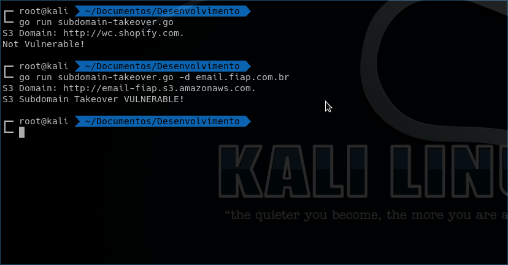

# AMAZON S3 SUBDOMAIN TAKEOVER CHECK

Tool for check amazon s3 subdomain takeover made in Golang.

# Install
```
$ go get github.com/miekg/dns
$ go build subdomain-takeover.go
```
# Running
```
$ ./subdomain-takeover -d your-domain.com
```
# Screenshot 



[Takeover proofs](https://0xpatrik.com/takeover-proofs/)

[Reference](https://github.com/EdOverflow/can-i-take-over-xyz)
